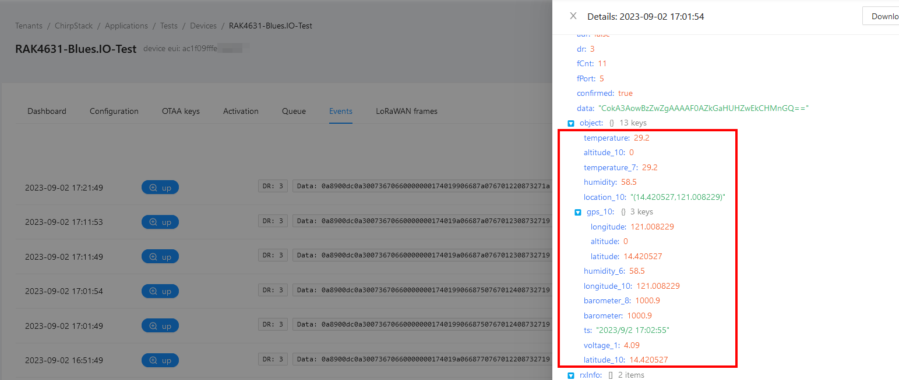

# WisBlock Goes Blues
|  |  |  |    
| :-: | :-: | :-: | 

----

While WisBlock is usually associated with _**LoRa**_ and _**LoRaWAN**_, this time we are diving into the cellular data transmission using the Blues.IO Notecard. This project is about building a location tracker that can connect to both LoRaWAN and a cellular connection with a [Blues NoteCard](https://blues.io/products/notecard/)↗️.

# Overview
When I got a [Blues Notecard](https://blues.io/products/notecard/)↗️ for some testing, the first thing was of course to connect it to the WisBlock modules. After some initial testing like connecting the Notecard to my cellular provider and sending some sensor data, I was hungry for more.    

One of the requirements that often come up for location trackers is to have a combined LoRaWAN and cellular connectivity, both working as a fallback connection for the other.

So, after building the [Hummingbird Sensor Network](https://github.com/beegee-tokyo/Hummingbird-Blues-Gateway)↗️, the logical next step was to crate a location tracker. 

----

# Setup the WisBlock Blues Location Tracker

----

## Hardware
The only thing that requires some work is to setup the WisBlock system with the Blues Notecard using the [RAK13102 NoteCarrier](https://store.rakwireless.com/collections/wisblock-wireless)↗️. The RAK13102 plugs into the WisBlock Base Board IO slot, so the RAK19007, RAK19001, RAK19010 or RAK19011 Base Boards can be used. 
The RAK13102 module blocks the Sensor Slots A and B, but it has a mirror of these two slots, so they still can be used.     
Optional you can add a RAK1906 environment sensor to the WisBlock Base Board.

The code in this repository supports beside of the communication to the Blues Notecard, the LoRaWAN connection and a RAK1906 environment sensor.

## Setup

### ⚠️ _NoteCard Setup (1)_ ⚠️    
You have to setup your Notecard at Blues.IO before it can be used. This setup is not scope of this README, please follow the very good [Quickstart](https://dev.blues.io/quickstart/)↗️ guides provided by Blues.    

### ⚠️ _NoteCard Setup (2)_ ⚠️        
To connect the Blues Notecard, a _**Product UID**_ is required. This product UID is created while you setup your Notecard in the Notehub following the above mentioned Quickstart.     
This application includes AT commands to add the product UID to the NoteCard.    

_**`ATC+BEUI=com.my-company.my-name:my-project`**_

The current product UID can be queried with

_**`ATC+BEUI=?`**_


### ⚠️ _NoteCard Setup (3)_ ⚠️    
There are two options for the Blues NoteCard to connect. The primary option is to use the eSIM that is already on the NoteCard. However, there are countries where the eSIM is not working yet. In this case you need to use an external SIM card in the RAK13102 WisBlock module. This can be a SIM card from you local cellular provider or a IoT data SIM card like for example a SIM card from [Monogoto](https://monogoto.io/)↗️ or from another provider.    
If using an external SIM card, this can be setup as well with an AT command.     

The syntax is _**`ATC+BSIM=<SIM>:<APN>`**_    
`<SIM>` == 0 to use the eSIM of the NoteCard
`<SIM>` == 1 to use the external SIM card of the RAK13102 NoteCarrier

If the external SIM card is selected, the next parameter is the APN that is required to connect the NoteCard
`<APN>` e.g. _**`internet`**_ to use with the Philippino network provider SMART.    
Several carriers will have a website dedicated to manually configuring devices, while other can be discovered using APN discovery websites like [apn.how](https://apn.how/)↗️ 

### ⚠️ _LoRaWAN Setup_ ⚠️    
Beside of the cellular connection, you need to setup as well the LoRaWAN connection. The WisBlock solutions can be connected to any LoRaWAN server like Helium, Chirpstack, TheThingsNetwork or others. Details how to setup the device on a LNS are available in the [RAK Documentation Center]().

On the device itself, the required setup with AT commands is
```log
        // Setup AppEUI
AT+APPEUI=70b3d57ed00201e1
        // Setup DevEUI
AT+DEVEUI=ac1f09fffe03efdc
        // Setup AppKey
AT+APPKEY=2b84e0b09b68e5cb42176fe753dcee79
        // Set automatic send interval in seconds
AT+SENDINT=60
        // Set data rate
AT+DR=3
        // Set LoRaWAN region (here US915)
AT+BAND=5
        // Reset node to save the new parameters
ATZ
        // After reboot, start join request
AT+JOIN=1,0,8,10
```
A detailed manual for the AT commands are in the [AT-Command-Manual](https://docs.rakwireless.com/RUI3/Serial-Operating-Modes/AT-Command-Manual/) ↗️

----

## Using the WisBlock Blues Tracker    

Once the WisBlock Blues Tracker is setup for both cellular and LoRaWAN connection, it will connect to the cellular network and join the LoRaWAN server.    
Independent of a successful connection it will start acquiring the location with the GNSS engine that is built into the NoteCards cellular modem.    

The current application is (not yet, work in progress) sending data based on movement, only in the specified time interval. The send interval can be setup with an AT command as well:

_**`ATC+SENDINT=300`**_    
will set the sendinterval to 300 seconds.    

The current send interval can be queried with    
_**`ATC+SENDINT=?`**_

### ⚠️ _Bug Alarm_ ⚠️     
In the current status, there is a problem

At the same ti
As I am using the "standard" data format of my WisBlock examples, many of my existing WisBlock example application can be used without any changes:    

- [WisBlock-Seismic-Sensor](https://github.com/beegee-tokyo/WisBlock-Seismic-Sensor)
- [WisBlock-Seismic-Sensor](https://github.com/beegee-tokyo/WisBlock-Seismic-Sensor/tree/main/PIO-Arduino-Seismic-Sensor) (only the Arduino version of the application, the RUI3 version needs some changes)
- [RUI3 door/window status](https://github.com/beegee-tokyo/RUI3-RAK13011)
- [RAK4631-Kit-4-RAK1906](https://github.com/beegee-tokyo/RAK4631-Kit-4-RAK1906)
- [RAK4631-Kit-1-RAK1901-RAK1902-RAK1903](https://github.com/beegee-tokyo/RAK4631-Kit-1-RAK1901-RAK1902-RAK1903)
- [WisBlock Indoor Air Quality Sensor](https://github.com/beegee-tokyo/WisBlock-IAQ-PM-CO2-VOC-EPD)

For other (older) example codes, it is required to add the LoRa P2P send functionality and/or extend the CayenneLPP data packet with the device identifier. I use the DevEUI of the device as unique device identifier, as every WisBlock Core has the unique DevEUI printed on its label.     
In my examples, I use the [CayenneLPP library from ElectronicCats](https://github.com/ElectronicCats/CayenneLPP) with my own class extension. When using this library, the data packet is generated in **`WisCayenne g_solution_data(255);`**. The unique device identifier (the DevEUI) is added at the start of the existing data packet using this few lines of code:

----

### ⚠️ Using WisBlock-API-V2: ⚠️    
```cpp
// Add unique identifier in front of the P2P packet, here we use the DevEUI
uint8_t p2p_buffer[g_solution_data.getSize() + 8];
memcpy(p2p_buffer, g_lorawan_settings.node_device_eui, 8);
// Add the packet data
memcpy(&p2p_buffer[8], g_solution_data.getBuffer(), g_solution_data.getSize());
```    
before sending the packet with
```cpp
send_p2p_packet(p2p_buffer, g_solution_data.getSize() + 8);
```
----
### ⚠️ Using RUI3: ⚠️
```cpp
uint8_t packet_buffer[g_solution_data.getSize() + 8];
if (!api.lorawan.deui.get(packet_buffer, 8))
{
	MYLOG("UPLINK", "Could not get DevEUI");
}

memcpy(&packet_buffer[8], g_solution_data.getBuffer(), g_solution_data.getSize());

for (int idx = 0; idx < g_solution_data.getSize() + 8; idx++)
{
	Serial.printf("%02X", packet_buffer[idx]);
}
Serial.println("");
```    
before sending the packet with
```cpp
api.lorawan.psend(g_solution_data.getSize() + 8, packet_buffer);
```
----

# Hummingbird in Action

----

## Hummingbird Gateway    

After doing the hardware setup, flashing the firmware and following Blues Quickstart guides to setup my Notehub and the Notecard, my existing sensors are able to send data to the Hummingbird Gateway.

Here is an example log output with the result of the CayenneLPP data parsing then the packet sent from the gateway over the Notecard:
<center></center>

----

## Blues Notehub 
The notes send to the Blues Notehub can be seen in the _**Events**_ listing of the Nothub
<center></center>

----

To forward the messages to Datacake, a _**Route**_ has to be defined in the Notehub. There are many easy to follow tutorials available in the Blues documentation, in this case I used of course the [Datacake Tutorial](https://dev.blues.io/guides-and-tutorials/routing-data-to-cloud/datacake/) to setup the routing.

Once the route has been setup, the Notefiles used in this route have to been selected. As all sensor nodes data are sent as _**sensor.qo**_, this _**Note**_ has to be enabled.

### ⚠️ INFO ⚠️    
Different to the tutorial steps, I did not use the Transform Data option !!!!

<center></center>

----

Now the routing events are shown in the Routes log view:
<center></center>

----

When opening one of these events, the sensor data can be seen in the Body view:
<center></center>

----

## Datacake

To visualize the data in Datacake a matching device has to be defined, as it is described in the [Datacake Tutorial](https://dev.blues.io/guides-and-tutorials/routing-data-to-cloud/datacake/).

### ⚠️ INFO ⚠️    
As Hummingbird is sending sensor data from different sensor nodes to one end-point, a different payload decoder is required !!!!

I wrote a payload decoder that separates the incoming sensor data depending on the sensor node ID into different fields. This is required to distinguish between the data of the sensor nodes. The Datacake decoder for this task is the file [Decoder.js](./Decoder.js) in this repository.    
The content of this file has to be copied into the _**HTTP Payload Decoder**_ of Datacake:    
<center></center>

----

Then the matching fields for the sensor data have to been created. The easiest way to do this is to wait for incoming data from the sensors. If no matching field is existing, the data will be shown in the _**Suggested Fields**_ list in the configuration:
<center></center>    

The sensor data can be easily assigned to fields using the _**Create Field**_ button.    

----

Once all the sensor data is assigned to fields, we can start with the visualization of the data.     
<center></center>
As you can see, there are multiple fields for battery, temperature, humidity, ..., but each field has a leading device ID!    

----

Datacake has two options, the first one is the _**Device Dashboard**_, but as we expect a lot of data from different devices, it would be quite crowded and difficult to distinguish between the different devices. To make it easier to view the data per devices, I instead created a device independent _**Dashboard**_ that allows me to create tabs to separate the data from the different sensors. Such Dashboards can be created with _**Add Dashboard**_ on the left side of the Datacake panel:
<center></center>

----

After creating the _**Dashboard**_ I clicked on the button on the right side to enable editing, then on _**Edit Dashboard Meta**_. 
<center></center>
In the opening window I added a tab for each of my Hummingbird sensor devices:
<center></center>

This allows me to sort the data from the different sensor nodes into these tabs.    

----

I will not go into details how to create visualization widgets in Datacake, this step is handled in other tutorials already.    

----

The final result for the two sensors and the sensor gateway that are sending sensor data looks like this:

_**Sensor Device 1 is a particulate matter sensor**_
<center></center>    

_**Sensor Device 2 is a barometric pressure sensor**_
<center></center>

_**Sensor Device 3 is the Hummingbird gateway that I enquipped with an environment sensor**_    
<center></center>    

----
----

# LoRa® is a registered trademark or service mark of Semtech Corporation or its affiliates. 


# LoRaWAN® is a licensed mark.

----
----